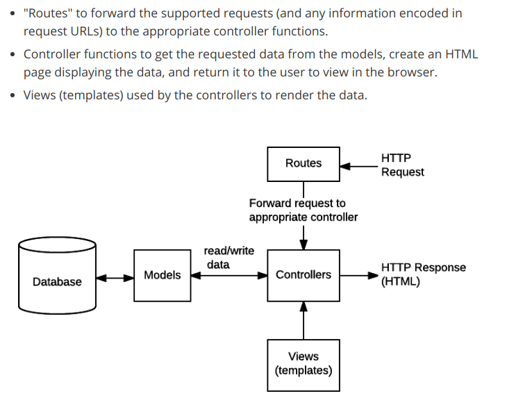

# Design Document
## Vocabulary

Routes: forward requests to controller

Controller: request information from model, create the HTML page using a JavaScript template engine such as EJS

Views (templates): rendered data

Source: [MDN](https://developer.mozilla.org/en-US/docs/Learn/Server-side/Express_Nodejs/routes)

## Diagram

Source: [MDN](https://developer.mozilla.org/en-US/docs/Learn/Server-side/Express_Nodejs/routes)

## Folder Structure

    /bin

The entry point of the Express application. Sets up the server and gets it running on the host.

    /config

The file, [config.js](config/config.js), contains environmental variables to be used across the server files, such as the host and port the application will be hosted on. These variables are constants that are exported as a Node module. As a result, they can be imported from other Node files. 

    /controllers

This folder contains controllers, the Node files that obtain information from models and display the data under views.

    /deliverables

This folder contains deliverables for this course.

    /docs

This folder contains documentation, such as meeting notes and requirements for the client. 

    /models

This folder contains model files, which are responsible for hitting the database API and storing information in schemas in Node.

    /node_modules

This folder contains node modules and dependencies required to run the project.

    /public

This folder contains static files such as images, javascript files such as jquery and bootstrap, as well as stylesheets. 

    /routes

This folder contains route files which are responsible for  routing requests to controllers.

    /test

This folder contains Jest unit testing files.

    /views

This folder contains view files, which are responsible for rendering data to the browser. These files output what the user sees on the screen.

## Other Files

    .gitignore

This file is used to prevent Git from commiting unwanted files to the repository.

    /bin/www

This file is used to setup the Express server. 

    app.js

This file is used to setup Expres routers, error handling, and the initial view.

    package.json

This file is used to setup the node package manager.

    README.md

This file contains documentation.